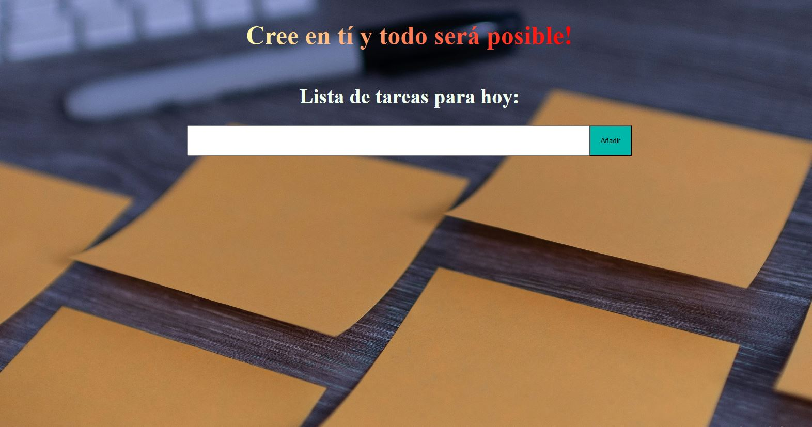

# To-Do List App

##  Demo  
🔗 [View the app on Netlify](https://lily-lista-de-tareas.netlify.app)

## Project Description

This application allows users to create a to-do list and cross out completed tasks.  
The app is built using HTML, CSS, and JavaScript.  
Each list item (`<li>`) can be added and removed using JavaScript. GSAP animations are also used.

No installation is required.

## Here's what the app looks like:

### How to Use:
1. Enter tasks one by one, pressing Enter after each entry or clicking the **"Añadir"** button.
2. The added tasks will appear in the list below.
3. To cross out a task, click on it once.
4. To delete a task, double-click on it.

### Features:
- Adding and removing list items using JavaScript and GSAP animations.
- Intuitive user interface.

## Requirements
- A modern web browser with JavaScript support.

